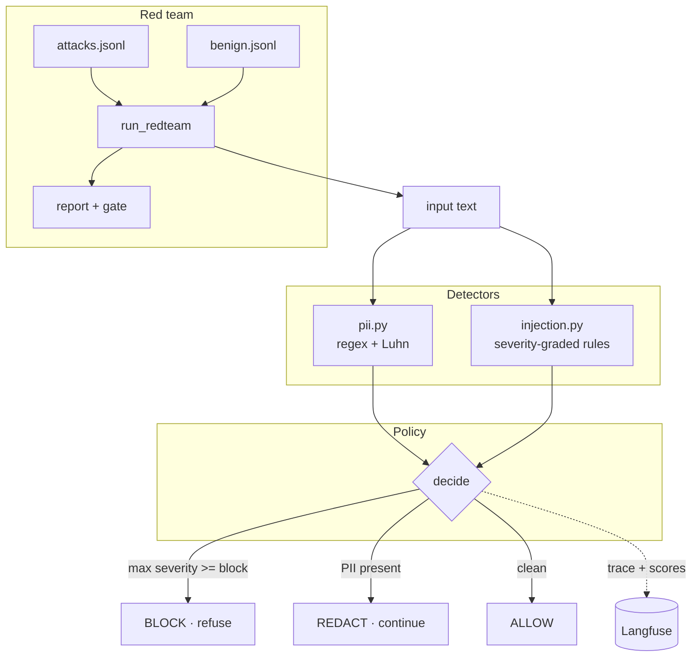

# Architecture

## The idea

Guardrails are only trustworthy if you can *measure* them. This repo pairs a small,
auditable defense pipeline with an adversarial test suite that scores it — so a
change to a detector shows up as a number, and CI fails if the defense regresses.

## Two halves

1. **The defense** — detectors → policy → pipeline. Given any text, decide whether
   to allow it, redact PII from it, or block it outright.
2. **The red team** — a labeled set of attacks (plus benign controls) run through
   the defense, scored into a report with a CI gate.

## Flow

## Detection design

**PII / secrets** (`detectors/pii.py`) — ordered regexes, most-specific first
(AWS key, API key, email, SSN, credit card, phone, IP). Overlapping matches are
dropped so a credit card isn't also reported as a phone number. Credit-card matches
are confirmed with the **Luhn checksum** to cut false positives. The optional
`presidio` extra provides NER-based detection behind the same `PiiEntity` interface.

**Prompt injection / jailbreak** (`detectors/injection.py`) — named regex rules each
carry a **severity** (1 low / 2 medium / 3 high). High-severity rules (instruction
override, system-prompt reset, jailbreak persona, system-prompt leak, secret
exfiltration) block; medium rules (role-play bypass, refusal suppression, encoding
evasion) are recorded for observability and contribute context. Rules are used,
not a model, so the guardrail is deterministic and auditable.

## Policy

`decide()` applies a strict priority:

1. **Block** if any injection signal meets `block_severity` — and return *no*
   sanitized text (we never hand back a cleaned attack).
2. **Redact** if PII is present in otherwise-benign text, returning a `[TYPE]`-masked
   version so the request can proceed safely.
3. **Allow** otherwise.

## Red-team scoring

`run_redteam()` runs every labeled case through `scan_input` and compares the actual
action to the expected one:

- `attack_catch_rate` — fraction of attacks correctly blocked or redacted.
- `benign_pass_rate` — fraction of benign controls correctly allowed (the
  false-positive guard).

Both are gated in CI (`THRESHOLDS`). The numbers are computed from real decisions —
including one intentionally obfuscated attack that the rule set misses, so the catch
rate is an honest `< 100%`.

## Observability

Each scan is wrapped in a Langfuse span (`Tracer.trace`) with the decision and the
PII/injection counts attached as scores. The client is fully optional and guarded:
with no keys set, `Tracer.active` is `False` and every call is a no-op, so the suite
and CI stay offline.
